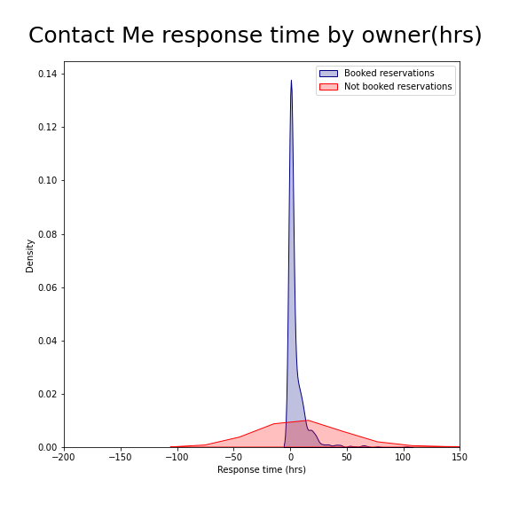

# Airbnb_Rio_de_Janeiro
Air BnB has seen explosive growth in the last 10 years.  After its founding in 2008 by Brian Chesky, Nathan Blecharczyk, and Joe Gebbia, it has grown to become a 93 billion dollar market cap company pulling in annual revenues of 3.378 billion dollars in 2020. Brazil in its own right has seen an influx of growth and economic development in recent years in large part due to its thriving tourism industry.  The the past decade Brazil has been host to a football(soccer) world cup, a summer olympic games, as well as its annual Carnival.  

This case study will do its best to leverage data analytics and computer modeling to provide insights into better business opportunties and increase value in Air Bnb's business model.

# Dataset Overview:
Air B&B - Rio De Janeiro
* 68 Neighborhoods
* Booking Request from January 1st 2016-June 30 2016
* 8959 unique Hosts
* 22,566 unique guests from 121 different countries
* 3 Different accommodation types (Entire home, Private Room, Shared Room)
* 12819 Unique rental properties
* Booking request
* 3 separate booking types ( Contact me, Book-it, Instant Book)
* 27,979 unique booking requests

# Metrics: Convert non-Bookings to Bookings

Success Metric(SM):
* SM = #Booked/#Total Booking Requests

* Total Booking Requests = Total Booked/(Total Booked + Total Not Booked)

* 7.7% Success Rate (92.3% of “contact me” booking-types go unbooked)

* 47.3 Success Rate (52.4% of “ book-it” booking-types go unbooked)

* Instant book inherently accepts all requests

* Contact Me is most common request-type and lowest Success Metric

# Characteristics of Booked (Blue) and Unbooked requests (Red)

## Characteristics of Note:
*  number of interactions between host and guest (top-right)

*  Response time of Host (bottom-right)

# Categorical Data on Contact Me Interactions

*  Majority of guests in Contact me group are “New Users”

*  Majority of rental property request is for Entire Home/Apartment

*  All types have low success-rate

# Fast response Hosts are more likely to be in Booked category

# Number of interactions between host and guest suggests a higher Booking rate

*  Could be causative
    * Host/guests who interact more have higher trust level and are more likely to book in a 2-sided market

*  Could be survivorship Bias

*  People who no longer want a rental transaction stop sending messages

# Recommendations: Reduce Friction on Host/Guest Interactions

1) Forward messages to Host SMS/text messaging to improve Host responsiveness(or smart-phone notifications)
    
    a) Booking rate drops dramatically after 24 hour period

2) Reduce friction on language barriers (auto-translation features)
    
    a) Top 5 countries (Brazil, USA, Argentina, France, Germany) all have different languages

3) Entice Hosts to Book-it category by offering add-ons
    
    a) ML add-on option: Guests prediction model booking rate
    
    b) Higher percentage of revenue to Hosts w/ Book-it, Instabook option

# Future Directions:
1) Photos and description Data of listings
    a) Natural Language Processing (NLP) of listing data across languages
    b) Photo data, potential image processing (CNN), on images to identify successful photo types of bookings

2) Pricing Data
    a) Numerical Pricing data would help identify outliers and would likely be an important feature in creating a predictive model for successful bookings

3) Improve data on neighborhoods ~ 42.4% of listings are unknown neighborhoods
    a) Improve Geojson data for neighborhood groupings

<!--  -->
